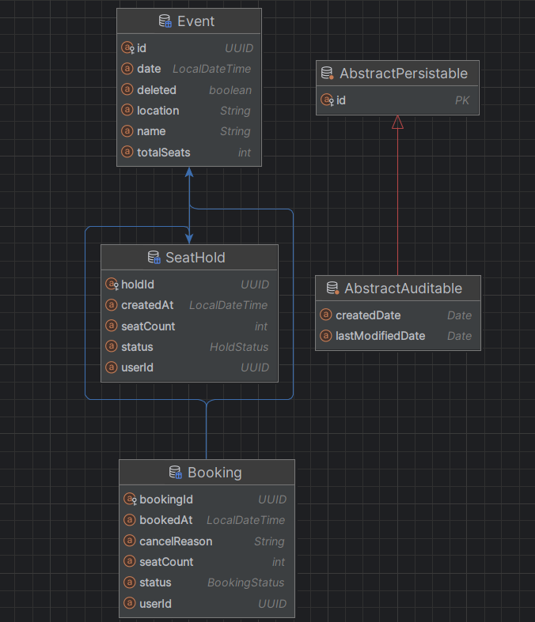

# TICKET ORDERING SYSTEM 

> This project was developed as part of an assignment for **SPRY BackEnd Developer Role**.

## Project Description

This is a backend REST API for booking event tickets, designed to handle concurrent booking attempts using a temporary seat reservation mechanism. The system supports creating and managing events, temporarily holding seats for users, confirming bookings, and automatically expiring unconfirmed holds after 5 minutes. The goal is to ensure reliable concurrency handling, data integrity, and a responsive booking experience under high contention.

##  Tech Stack

- **Java 21**
- **Spring Boot**
- **H2 Database**
- **Hibernate**
- **Lombok**
- **Gradle**

---

## Major Flows ( DB Schema & API Endpoints )
## Tables

### event Table
- { id, name, event_date, location, total_seats, is_deleted }

### seat_hold Table
- { hold_id, event_id, user_id, seat_count, created_at, status }
  - { fk_seathold_event -> FOREIGN KEY (event_id) REFERENCES event(id) }

### booking Table
- { booking_id, event_id, user_id, seat_count, booked_at, status, hold_id, cancel_reason }
  - { fk_booking_event -> FOREIGN KEY (event_id) REFERENCES event(id) }
  - { fk_booking_hold -> FOREIGN KEY (hold_id) REFERENCES seat_hold(hold_id) }

## APIs

### APIs for CRUD on events
1. POST   /events/createEvent
2. GET    /events/getAllEvents  - (shows event columns + total tickets booked for each event)
3. GET    /events/getEvent/{id}
4. PUT    /events/updateEvent/{id}
5. DELETE /events/deleteEvent/{id} - (soft delete, sets is_deleted)

### APIs for seat Reservations and Booking
6. POST   /events/holdSeats/{eventId}
7. DELETE /events/cancelHold/{holdId}

### Booking Management
8. POST   /bookings                - confirm booking (from a hold)
9. GET    /bookings/getBookings/{userId} - view all bookings for a user
10. DELETE /bookings/cancelBooking/{bookingId} - cancel a booking (with optional reason)

### Availability
11. GET   /events/availability/{eventId} - event details + available seats (total - booked - on hold)

## Constraints & Key points

- allow concurrent booking  -> we handle this while calling holdSeats api

- temporary seat reservation -> holdSeats feature is used to acheive this

- never book more seats than available -> handled at holdSeats api (also, if dashboard is calling getAllEvents api, we can make an event with no seats non-clickable, still BE handling is a must)

- prevent double booking for the same user and event - if an user (user_id) has booked ticket(s) for a certain event (id), don't allow anymore booking for same user (holding itself should fail) -> hold seats api will handle this too.

---
### UML Diagram




---

## Running the Project

### Prerequisites

- Java 17+
- Gradle (or use the included Gradle wrapper)

### Steps to Run

```bash
# Clone the repository
git clone https://github.com/SaiGopal-Challa/TicketOrderSystem.git
cd TicketSystemSPRY

# Run the application
./gradlew bootRun
```
